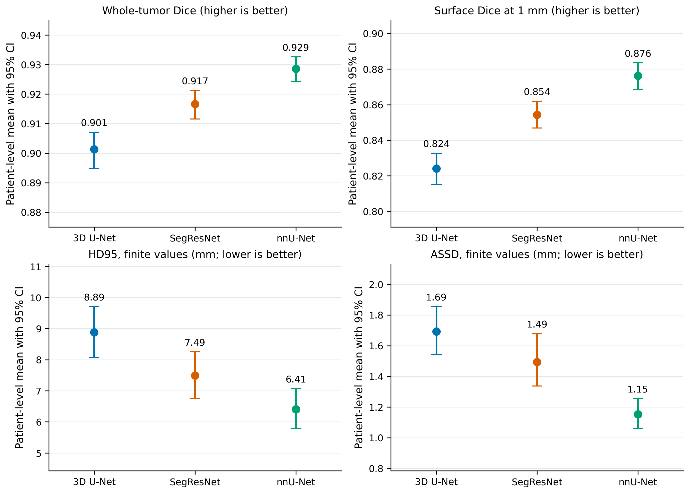

# Glioma 3D anatomical visualization and patient-grouped segmentation benchmark

Research repository accompanying **Development of Customized Three-Dimensional Models of Gliomas for Preoperative Anatomical Visualization**, by **Yonny Josue Mera Macias**, Yachay Tech University.

This repository contains the terminal-based CEDIA experiment, its recorded results, reproducible statistical figures, and the historical Streamlit visualization prototype. The experiment evaluates binary whole-tumor segmentation from four MRI modalities using 3D U-Net, SegResNet and nnU-Net.

**Research use:** the prototype is not clinically validated. Whole tumor includes edema and does not define a surgical resection margin. The newly evaluated models have not been deployed or validated as replacements for the historical application ensemble.

## Results at a glance

Patient-grouped five-fold evaluation: **1,250 studies, 1,132 patients, 15 trained models**. Each study is evaluated only by its own outer-fold checkpoint.

| Model | Epochs per fold | Mean patient Dice | Bootstrap 95% CI |
|---|---:|---:|---:|
| 3D U-Net | 20 | 0.9013 | 0.8949–0.9071 |
| SegResNet | 20 | 0.9167 | 0.9116–0.9213 |
| nnU-Net | 100 | 0.9285 | 0.9241–0.9326 |



Confidence intervals resample patients within fixed outer folds and are conditional on the trained checkpoints. nnU-Net uses a different preprocessing, optimization and training budget: this is a comparison of pipelines, not an architecture-only ablation. See [results](docs/RESULTADOS.md), [model card](docs/MODEL_CARD.md) and [dataset/protocol](docs/DATASET.md).

## Start here

| Purpose | Instructions |
|---|---|
| Inspect results without downloading MRI or weights | [Results and figure captions](docs/RESULTADOS.md) |
| Check the repository with Python only | `python scripts/verify_repository.py` |
| Regenerate figures or statistical analysis | [Reproducibility guide](docs/REPRODUCIBILIDAD.md) |
| Train/evaluate on a GPU allocation in CEDIA | [Terminal workflow](cedia/README_CEDIA.md) |
| Install the selected checkpoints | [Weights and releases](docs/PESOS.md) |
| Run the historical interactive prototype | [Application guide](docs/APLICACION.md) |
| Upload this project to GitHub | [Publication guide](docs/PUBLICAR_GITHUB.md) |

Detailed execution guides are in Spanish. Commands are run from the repository root; no notebook is required.

## Repository layout

```text
app.py, backend.py       Historical Streamlit prototype
cedia/                  Training, evaluation, metrics, analysis, CLI and tests
scripts/                Cohort preparation, weight installation, figures, verification
tests/                  Packaging and data-preparation tests
provenance/              Exact patient manifest, checkpoint hashes, recorded environments
results/                Completed experiment records and tabular results
docs/                   Protocol, model/data cards, guides and publication figures
legacy/                 Original notebook, outputs removed, historical reference only
.github/workflows/      CPU checks for future pushes and pull requests
CITATION.cff             Repository citation metadata
```

Raw MRI, segmentations, virtual environments, executables and checkpoint binaries are not committed. Weights are separate release assets listed in [provenance/weights.json](provenance/weights.json); this file records their hashes, not an uncreated download URL. The thesis manuscript/PDF remains a separate academic deliverable; this repository contains its computational companion.

## Verification and limitations

The CEDIA numerical implementation is retained. Packaging adds portable paths, cohort reconstruction, checkpoint installation and documentation. See [validation](docs/VALIDACION.md) for checks actually performed and [change log](CHANGELOG.md) for packaging changes. CPU checks do not reproduce a GPU training run or validate clinical use.

The final patient manifest must not be regenerated or replaced with the historical case-level CSV. Masks ending in `-segs.nii.gz` are accommodated by the cohort helper without altering the saved split.

## Citation and attribution

Use [CITATION.cff](CITATION.cff) to cite this computational companion and cite the dataset and methods separately. Dependency acknowledgments are in [THIRD_PARTY_NOTICES.md](THIRD_PARTY_NOTICES.md).

No open-source license has been selected by the author for this delivery. See [LICENSE.md](LICENSE.md); dataset and dependency terms remain separate.
